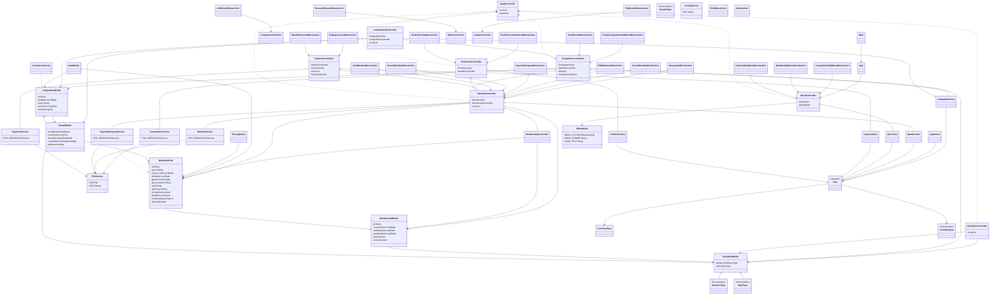
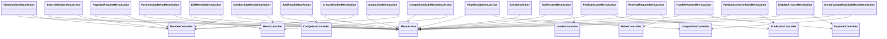

```mermaid
classDiagram
Main --> App
App --> MenuController
AddResultMenuAction --> CompetionController
AnonymizeMenuAction --> MemberController
CompetitionSubMenuMenuAction --> MenuController
CreateCompetitionSubMenuMenuAction --> CompetitionController
CreateMemberMenuAction --> MemberController
DisplayArrearsMenuAction --> PaymentController
EditMemberMenuAction --> MemberController
HandlePaymentMenuAction --> PaymentController
MemberSubMenuMenuAction --> MenuController
PaymentRequestMenuAction --> MemberController
PaymentSubMenuMenuAction --> MenuController
PredictIncomeDefinedMenuAction --> PredictionController
PredictIncomeMenuAction --> PredictionController
RenewalRequestMenuAction --> MeberController
SearchMemberMenuAction --> MemberController
TopResultsMenuAction --> LeaderController
ViewMemberMenuAction --> MemberController
ViewResultsMenuAction --> CompetitionController


MemberController o-- MemberView
MemberController o-- MembershipController
MemberController --> MemberModel
MemberController o-- PaymentRequestService
MemberController o-- MemberService

PaymentController o-- MemberController
PaymentController o-- PaymentService
DisciplineController --> DisciplineModel
PredictionController o-- PredictionView
PredictionController o-- MemberController

CompetitionController --o DisciplineModel
CompetitionController o-- CompetitionView
LeaderboardController --o CompetitionView
PaymentController o-- PaymentView
CompetitionController o-- MemberController
CompetitionController --> CompetitionModel
CompetitionController o-- CompetitionService
DisciplineController --> DisciplineModel
LeaderboardController --o CompetitionController
LeaderboardController --> CompetitionModel
LeaderboardController --> ResultModel
MemberController --> MembershipModel
MembershipController --> MembershipModel
MembershipController --> MemberModel
MenuController o-- MenuView
MenuController --> MenuModel

InputModel --> MemberModel
InputModel --> CompetitionModel
CompetitionModel --> ResultModel
DisciplineModel o-- DistanceType
DisciplineModel o-- StyleType
MemberModel --> MembershipModel
MembershipModel --> DisciplineModel
PricingModel --> MemberModel
ResultModel --> MemberModel
ResultModel --> DisciplineModel
ResultModel --> CompetitionModel


InputController <.. CompetitionController
InputController <.. LeaderboardController
InputController <.. MemberController
InputController <.. DisciplineController
InputController <.. PredictionController
InputController <.. MenuController


CompetitionService --> FileService
MemberService --> FileService
PaymentRequestService --> FileService
PaymentService --> FileService
CompetionService ..o CompetitionModel
MemberService ..o MemberModel
PaymentRequestService ..o MemberModel

CompetitionView --|> View
InputView --|> View
MemberView --|> View
MenuView --|> View
PaymentView --|> View
PredictionView --|> View
View --> ColorTextType
View --> ColorKeyType


class CompetitionController{
    -CompetitionView
    -MemberController
    -Arraylist<CompetitionModel>
    -CompetitionService 
}

class DisciplineController {
    -ArrayList<DisciplineModel>
}
class InputController{
    -Scanner
    -InputView
}
class LeaderboardController{
    -CompetitionView
    -CompetitionController
    -ArrayList<CompetitionModel>
}
class MemberController{
    -MemberView
    -MembershipController
    -ArrayList<MemberModel>
}
class MembershipController
class MenuController{
    -MenuView
    -MenuModel
}
class PaymentController{
    -MemberController
    -PaymentView
    -ArrayList<String>
    -PaymentService
}
class PredictionController{
    -PredictionView
    -MemberController
}
class CompetitionModel{
    -id:String
    -startDate:LocalDate
    -name:String
    -startTime:LocalTime
    -results:ArrayList<ResultModel>

}
class DisciplineModel{
    -distance:DistanceType
    -style:StyleType
}
class InputModel
class MemberModel{
    -id:String
    -name:String
    -Create_Date:LocalDate
    -birthdate:LocalDate
    -gender:GenderType
    -phonenumber:String
    -mail:String
    -ageGroup:String
    -competitive:boolean
    -disciplines:ArrayList<DisciplineModel>
    -memberships:ArrayList<MembershipModel>
    -deleted:boolean
}
class MembershipModel{
    -id:String
    -creationDate:LocalDate
    -startingDate:LocalDate
    -expirtingDate:LocalDate
    -paid:boolean
    -active:boolean
}
class MenuModel{
    -MENU_ACTIONS:MenuAction[]
    -MENU_HEADER:String
    -LOAD_TEXT:String
}
class PricingModel
class ResultModel{
    -member:MemberModel
    -resultTime:LocalTime
    -discipline:DisciplineModel
    -competition:CompetitionModel
    -placement:String
}
class DistanceType
class StyleType
class GenderType
<<Enumaration>> StyleType
<<Enumaration>> DistanceType
<<Enumaration>> GenderType

class CompetitionView
class InputView
class MemberView
class MenuView
class PaymentView
class PredictionView
class View
<<abstract>> View

class App
class Main

class ColorKeyType
<<Enumaration>> ColorKeyType
class ColorTextType

class CompetitionService{
    -FILE_SERVICE:FileService
}
class ConfigService{
    -KEY:String
}
class FileService{
    -FILE:File
    -PATH:String
}
class MemberService{
    -FILE_SERVICE:FileService
}
class PaymentRequestService{
    -FILE_SERVICE:FileService
}
class PaymentService{
    -FILE_SERVICE:FileService
}


class AddResultMenuAction
class AnonymizeMenuAction
class CompetitionSubMenuMenuAction
class CreateCompetitionSubMenuMenuAction
class CreateMemberMenuAction
class DisplayArrearsMenuAction
class EditMemberMenuAction
class ExitMenuAction
class HandlePaymentMenuAction
class MemberSubMenuMenuAction
class MenuAction
class PaymentRequestMenuAction
class PaymentSubMenuMenuAction
class PredictIncomeDefinedMenuAction
class PredictIncomeMenuAction
class RenewalRequestMenuAction
class SearchMemberMenuAction
class TopResultsMenuAction
class ViewMemberMenuAction
class ViewResultsMenuAction


```

```mermaid
classDiagram
AddResultMenuAction --> CompetionController
AnonymizeMenuAction --> MemberController
CompetitionSubMenuMenuAction --> MenuController
CreateCompetitionSubMenuMenuAction --> CompetitionController
CreateMemberMenuAction --> MemberController
DisplayArrearsMenuAction --> PaymentController
EditMemberMenuAction --> MemberController
HandlePaymentMenuAction --> PaymentController
MemberSubMenuMenuAction --> MenuController
PaymentRequestMenuAction --> MemberController
PaymentSubMenuMenuAction --> MenuController
PredictIncomeDefinedMenuAction --> PredictionController
PredictIncomeMenuAction --> PredictionController
RenewalRequestMenuAction --> MeberController
SearchMemberMenuAction --> MemberController
TopResultsMenuAction --> LeaderController
ViewMemberMenuAction --> MemberController
ViewResultsMenuAction --> CompetitionController
AddResultMenuAction --|> MenuAction
AnonymizeMenuAction --|> MenuAction
CompetitionSubMenuMenuAction --|> MenuAction
CreateCompetitionSubMenuMenuAction --|> MenuAction
CreateMemberMenuAction --|> MenuAction
DisplayArrearsMenuAction --|> MenuAction
EditMemberMenuAction --|> MenuAction
ExitMenuAction --|> MenuAction
HandlePaymentMenuAction --|> MenuAction
MemberSubMenuMenuAction --|> MenuAction
PaymentRequestMenuAction --|> MenuAction
PaymentSubMenuMenuAction --|> MenuAction
PredictIncomeDefinedMenuAction --|> MenuAction
PredictIncomeMenuAction --|> MenuAction
RenewalRequestMenuAction --|> MenuAction
SearchMemberMenuAction --|> MenuAction
TopResultsMenuAction --|> MenuAction
ViewMemberMenuAction --|> MenuAction
ViewResultsMenuAction --|> MenuAction

```