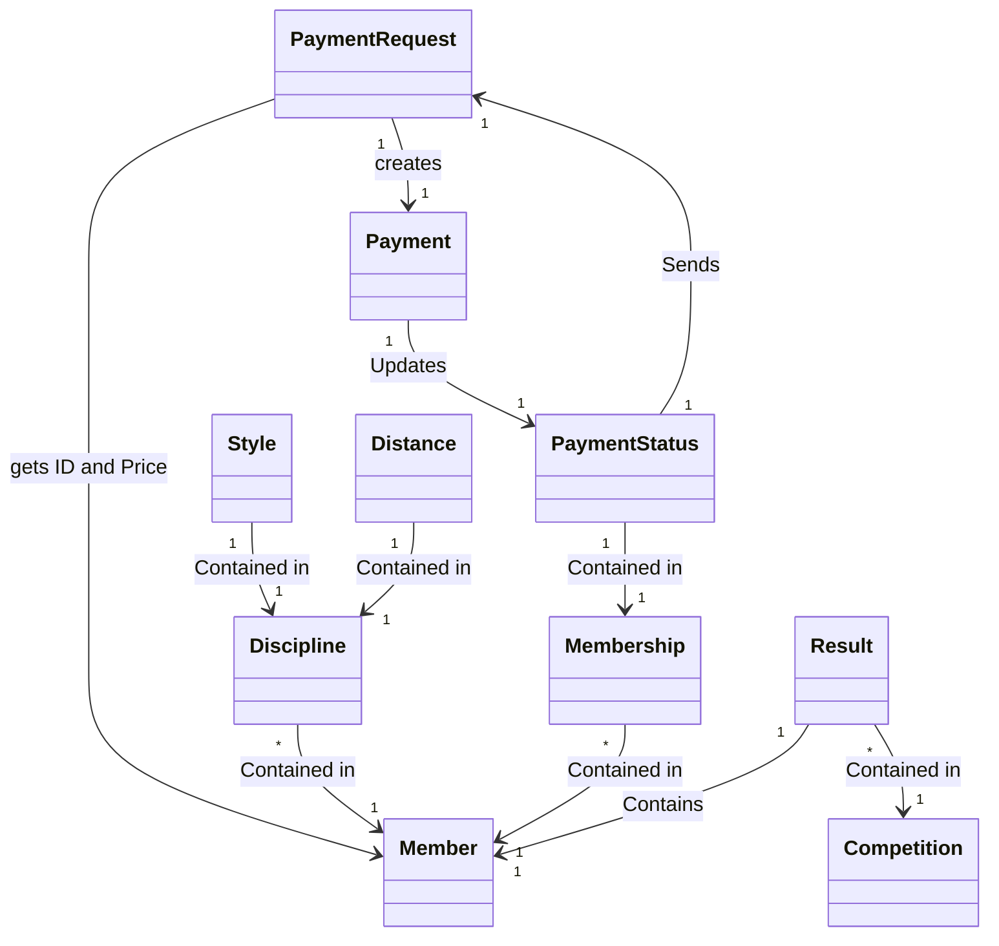

```mermaid
classDiagram
PaymentRequest --> Member : gets ID and Price
Style "1" --> "1" Discipline : Contained in
Distance "1" --> "1" Discipline : Contained in
Discipline "*" --> "1" Member : Contained in
PaymentStatus "1" --> "1" Membership :Contained in
Payment "1" --> "1" PaymentStatus : Updates
Membership "*" --> "1" Member : Contained in
Result "1" --> "1" Member : Contains
PaymentStatus "1" --> "1" PaymentRequest : Sends
PaymentRequest "1" --> "1" Payment : creates
Result "*" --> "1" Competition : Contained in

class Member

class Style

class Distance

class Discipline

class PaymentStatus

class Payment

class Membership

class PaymentRequest

class Competition

class Result

```
